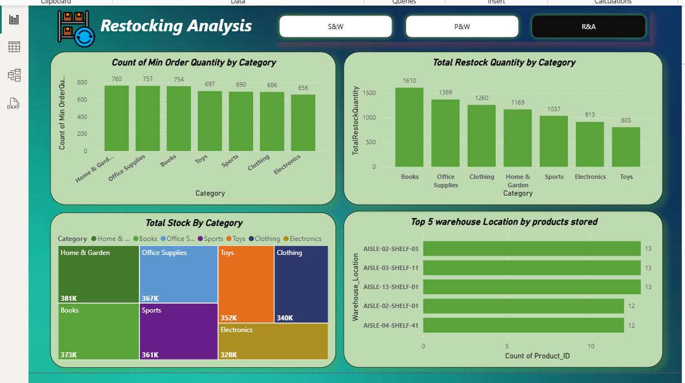
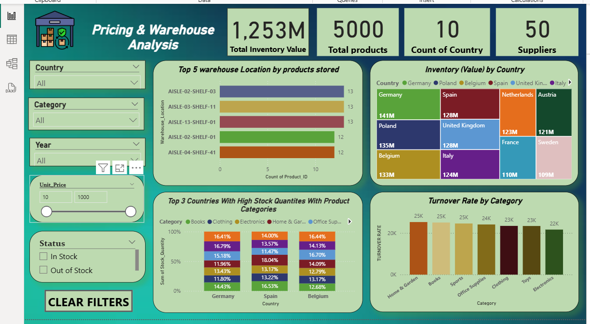
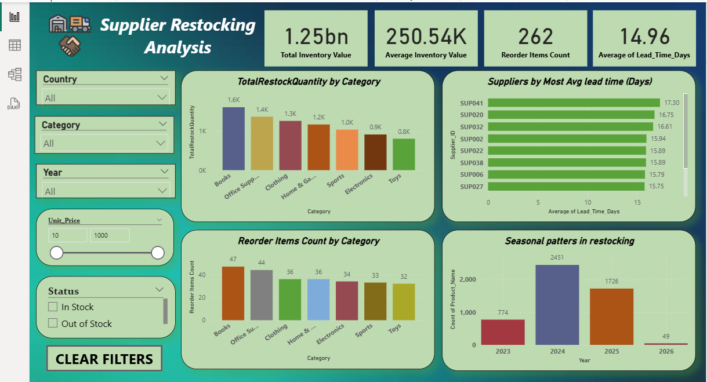

# Inventory_analysis
Power BI dashboard analyzing supplier restock and lead time metrics
# 📦 Inventory Analysis – Power BI Dashboards

## 🔍 Overview
This repository contains three interactive dashboards focused on inventory strategy: supplier restocking, pricing and warehouse efficiency, and category-wise performance. Built in Power BI with MySQL integrations and dynamic DAX visuals.

## 📊 Dashboard Previews

### 1. Restocking Analysis

Highlights reorder behavior and supplier patterns over time.

### 2. Pricing & Warehouse Insights
  
Visualizes inventory valuation and shelf performance across 10 countries and top suppliers.

### 3. Supplier Efficiency Dashboard
  
Compares supplier lead times and reorder item volume by category.

## 🛠 Technologies Used
- Power BI
- Power Query
- DAX

## 🔗 Portfolio
Explore all dashboards live at  
🔗 [mishab_portfolio](https://mishab-07.github.io/mishab_portfolio)
